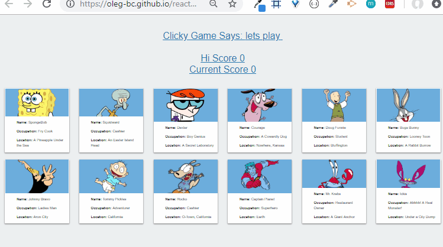
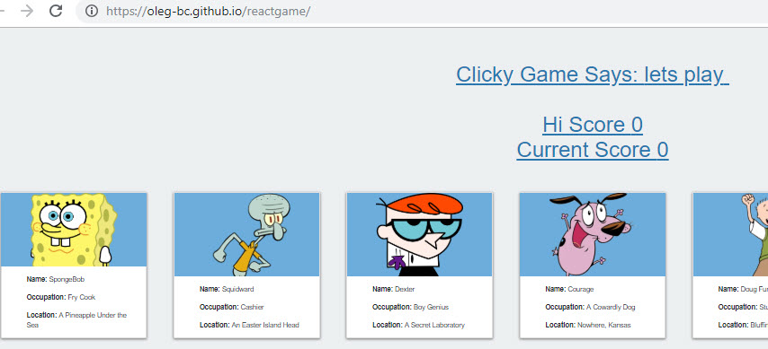
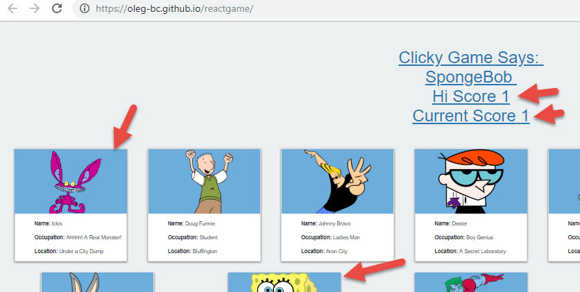
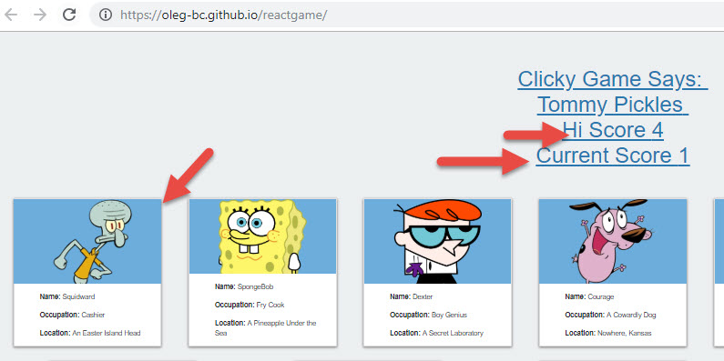
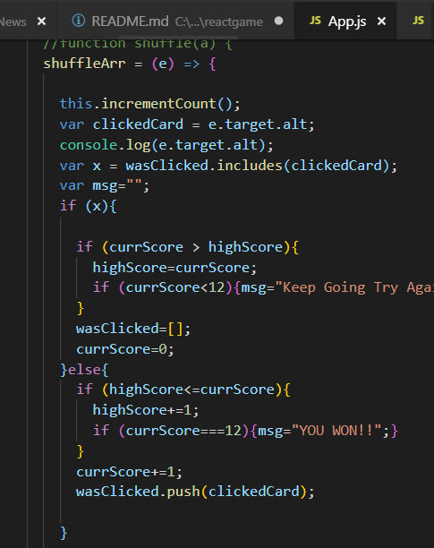

# reactgame
Clicky Game - implemented in react

A fun game to demo ReactJS. The game has no backend but demonstrates the rapid update and rendering capabilities of react. This game was challenging but fun to make.

Below are a gif and some images of the app flow: Game loads with characters awaiting user's click:

User can click on a character

Characters get shuffled and counters increment

And key code snippet

